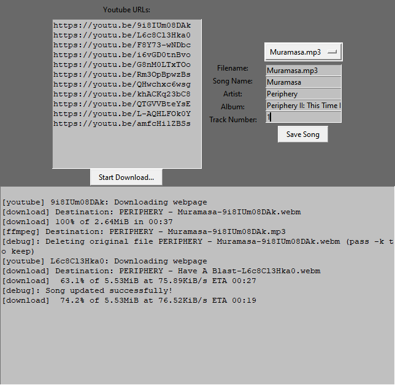

# Youtube to MP3
A simple tkinter UI that handles downloading music from youtube videos or playlists as MP3 files.

Additional functionality to set MP3 metadata and rename those files once they have been downloaded.

### Usage
 - Run `YTMP3.py` through the command line (`python3 YTMP3.py`, I'll see about converting it to a working executable at some point, it has a bit of trouble with finding the working directory to save and edit files)
 - Copy and paste the shareable links from youtube into the input text box
 - Click `Start Download...`
 - As songs are downloaded you will be able to select them from the dropdown box to the right. Once a song is selected you can set its metadata and save it to the file.

### Dependencies:
 - youtube_dl: https://pypi.org/project/youtube_dl/
 - eyed3: https://eyed3.readthedocs.io/en/latest/
 - ffmpeg needs to be added to your PATH: https://ffmpeg.org/

### Known Bugs:
 - Sometimes a youtube video download will randomly fail with a `403 Forbidden` error. It will keep track of each failure and paste the link at the bottom of the console logs once downloads are complete. You can retry the list afterwards and it will usually work on a second try. This is a problem with youtube.
 - Some weird graphical glitches in the song drop-down box occur sometimes when songs are downloaded into an empty directory, this usually cleans itself up as more are downloaded.
 - The app has a hard time renaming mp3 files with quotations in the name, you will have to manually rename those before reloading the songs.
