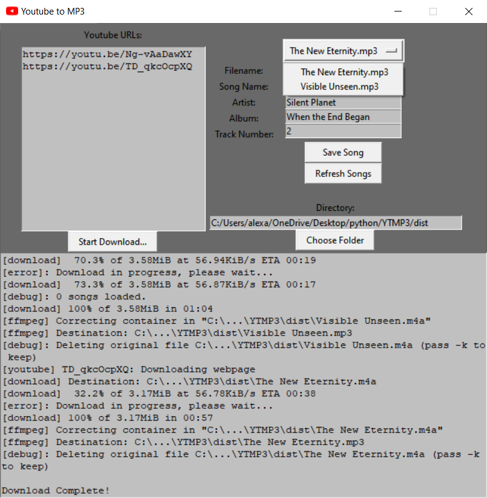

# Youtube to MP3
A simple application to handle downloading the audio from a list of youtube videos as MP3 files.

Additional functionality to set MP3 metadata and rename those files once they have been downloaded.

### Application
There are two ways to run the application.
 1. Run the python code through the command line directly with `python YTMP3.py`
 2. Run the [YTMP3.exe](dist/YTMP3.exe) executable. This is a standalone file and can be downloaded directly from github, it does not require the rest of the repo to function (simply navigate to the file and click `download`)

### Requirements:
These requirements are *only* required for running the application through the command line or building the executable through `build.bat`. They are *not* required for running the built `YTMP3.exe` executable.
  - yt-dlp: https://pypi.org/project/yt-dlp/ (`pip install yt-dlp`)
  - eyed3: https://eyed3.readthedocs.io/en/latest/ (`pip install eyed3`)
  - ytmusicapi: https://ytmusicapi.readthedocs.io/en/stable/ (`pip install ytmusicapi`)
  - The ffmpeg executable needs to be added to `resources/`
    - There is a current build of ffmpeg in [resources/ffmpeg.zip](resources/ffmpeg.zip), unzip this and move `ffmpeg.exe` to `resources/`

### Usage
 - Copy and paste youtube video links and/or youtube playlist links into the input text box
 - Click `Start Download...`
 - As songs are downloaded you will be able to select them from the dropdown box to the right. Once a song is selected you can set its metadata and save it to the file.
   - For ease of use, if you tab through certain fields it will auto populate if the field is left empty:
      - Song Name auto populates to the Filename without file extensions
      - Artist auto populates to the last saved artist
      - Album auto populates to the last saved album
      - Hitting `Return` while in Track Number (the last entry field) will save the current song and load the next song (if available)

### Fill Metadata
Selecting `Fill Metadata` before starting the download will attempt to autopopulate the metadata fields of downloaded songs using data from Youtube/Youtube Music.

This data is not always available and can autopopulate fields with publishers or Youtube channel names. Youtube Music has better results although it is a little inconsistent.

### Build
 - The attached `build.bat` batch script will construct an executable to use in `/dist`.
 - The `/build` directory can be safely deleted after the build is complete.
 - Requires pyinstaller (`pip install pyinstaller`)
